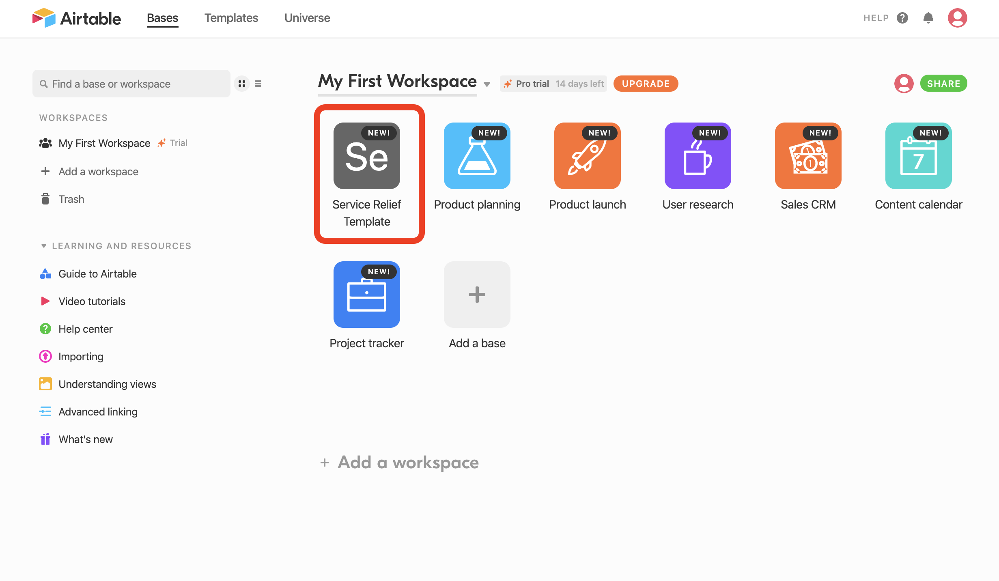
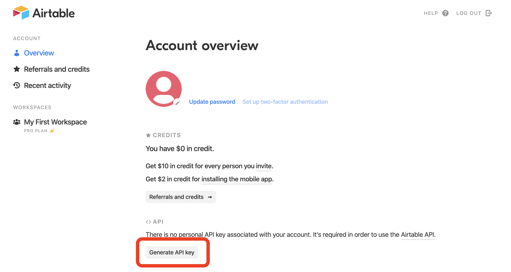
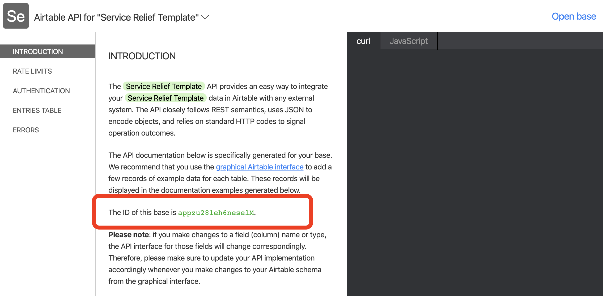
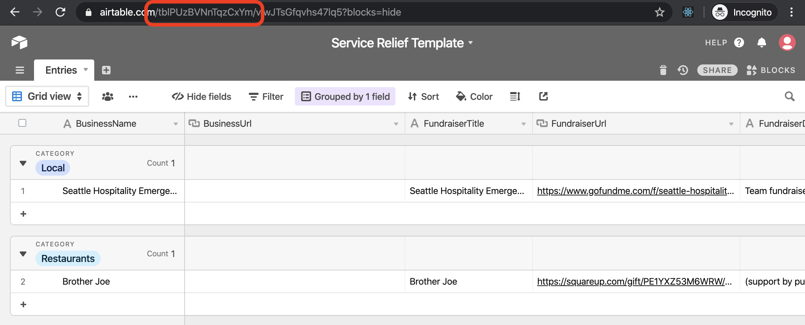
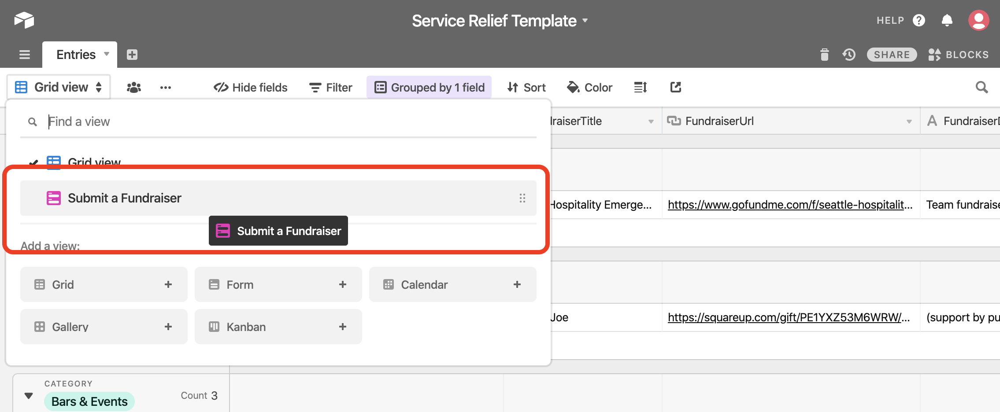

<!-- AUTO-GENERATED-CONTENT:START (STARTER) -->
<p align="center">
  <a href="https://www.gatsbyjs.org">
    
  </a>
</p>
<h1 align="center">
  Service Relief Starter
</h1>

Kick off your city's relief efforts as we all learn to cope with COVID-19 with this starter powered by Gatsby, Airtable, and community efforts.

## 🔧 Configuring a new site

You can get a service relief site up and running without touching any code! You'll need to (possibly) make a few accounts with free tiers from different websites and have two important things configured to have your site working correctly:

1. An **Airtable base** (like a fancier Google Sheet or Excel spreadsheet): this is where the information to populate fundraisers on the site comes from
2. A **copy of the code for the site**: this is what defines how the site looks, and takes your data to display on a webpage

### Airtable configuration

To setup Airtable, you can automatically create a new base configured for a service relief site by following this link: [https://airtable.com/addBaseFromShare/shroKwQGVsips8KI2?utm_source=airtable_shared_application](https://airtable.com/addBaseFromShare/shroKwQGVsips8KI2?utm_source=airtable_shared_application)

#### Registering and exploring the Service Relief Template

It will first prompt you to make an account if you don't have one, fill in name, email, and password and create an account. You can skip the onboarding flow prompts that Airtable pops up (but it's okay if you do them too).

Then you should see several tiles that correspond to individual "Bases" that Airtable has set up for you. You care about the one that was created based on the link you followed above, it should have created a base called "Service Relief Template".



If you click on the link you can explore the data prepoulated in it.

<!-- TODO add information about what NOT to delete and how to add records -->

#### Collecting keys and information you need from Airtable

Now with a base setup, you will need to collect **4 values** from Airtable that the code on your site will use to get information from Airtable automatically.

1. Your **API key**: this is yours and yours alone, your site can use it to prove to Airtable that your account is trying to get information, sort of like a key for a safe deposit box

Find your API key by navigating to your account at this link: [https://airtable.com/account](https://airtable.com/account), you should see a section labeled API and a button to "Generate API key".



Click the button and and then click on the dots to show your key, copy it somewhere you can access it when you're setting up your site.


1. The Service Relief Template **Base ID**: the base is where all your tables are stored, Airtable needs to know which base to grab data from.

Find your Base ID by navigating to this link: [https://airtable.com/api](https://airtable.com/api), if you are signed in and have created a base from the provided template you should see a list of bases in your workspace. Click on the one called "Service Relief Template".



1. The Service Relief Template **Table ID**: a table ID is needed by your site to tell Airtable what table of information to get the data from, out of the base that you provide (with the Base ID).

Find your Table ID by clicking on your "Service Relief Template" from the home page (when signed in): [https://airtable.com/](https://airtable.com/)

Then the ID can be found in the URL (or part of the website domain) between after the first slash ("/") and second slash (`https://airtable.com/your-table-id-is-in-this-section/viwJTsGfqvhs47lq5`). For example, if my Service Relief Template has this url: `https://airtable.com/tblPUzBVNnTqzCxYm/viwJTsGfqvhs47lq5`, my Table ID would be the part after `airtable.com/` and before `viwJTsGfqvhs47lq5`. You'll know it's your Table ID because it's prepended with `tbl`, in this case it's: `tblPUzBVNnTqzCxYm`.



1. The Service Relief Template's **submission form embed ID**: this is connected to a submission form that was created for you that will allow users on the site to submit potential fundraisers directly to your Airtable base, nice!

Find you submission form embed ID by clicking on "Grid View" at the top left of your base, and selecting "Submit a Fundraiser".



## 🚀 Quick start for code development

1.  **Create a Gatsby site.**

    Use the Gatsby CLI to create a new site, specifying the default starter.

    ```shell
    # create a new Gatsby site using the default starter
    gatsby new my-default-starter https://github.com/gatsbyjs/gatsby-starter-default
    ```

1.  **Start developing.**

    Navigate into your new site’s directory and start it up.

    ```shell
    cd my-default-starter/
    gatsby develop
    ```

1.  **Open the source code and start editing!**

    Your site is now running at `http://localhost:8000`!

    _Note: You'll also see a second link: _`http://localhost:8000/___graphql`_. This is a tool you can use to experiment with querying your data. Learn more about using this tool in the [Gatsby tutorial](https://www.gatsbyjs.org/tutorial/part-five/#introducing-graphiql)._

    Open the `my-default-starter` directory in your code editor of choice and edit `src/pages/index.js`. Save your changes and the browser will update in real time!

## 🧐 What's inside?

A quick look at the top-level files and directories you'll see in a Gatsby project.

    .
    ├── node_modules
    ├── src
    ├── .gitignore
    ├── .prettierrc
    ├── gatsby-browser.js
    ├── gatsby-config.js
    ├── gatsby-node.js
    ├── gatsby-ssr.js
    ├── LICENSE
    ├── package-lock.json
    ├── package.json
    └── README.md

1.  **`/node_modules`**: This directory contains all of the modules of code that your project depends on (npm packages) are automatically installed.

2.  **`/src`**: This directory will contain all of the code related to what you will see on the front-end of your site (what you see in the browser) such as your site header or a page template. `src` is a convention for “source code”.

3.  **`.gitignore`**: This file tells git which files it should not track / not maintain a version history for.

4.  **`.prettierrc`**: This is a configuration file for [Prettier](https://prettier.io/). Prettier is a tool to help keep the formatting of your code consistent.

5.  **`gatsby-browser.js`**: This file is where Gatsby expects to find any usage of the [Gatsby browser APIs](https://www.gatsbyjs.org/docs/browser-apis/) (if any). These allow customization/extension of default Gatsby settings affecting the browser.

6.  **`gatsby-config.js`**: This is the main configuration file for a Gatsby site. This is where you can specify information about your site (metadata) like the site title and description, which Gatsby plugins you’d like to include, etc. (Check out the [config docs](https://www.gatsbyjs.org/docs/gatsby-config/) for more detail).

7.  **`gatsby-node.js`**: This file is where Gatsby expects to find any usage of the [Gatsby Node APIs](https://www.gatsbyjs.org/docs/node-apis/) (if any). These allow customization/extension of default Gatsby settings affecting pieces of the site build process.

8.  **`gatsby-ssr.js`**: This file is where Gatsby expects to find any usage of the [Gatsby server-side rendering APIs](https://www.gatsbyjs.org/docs/ssr-apis/) (if any). These allow customization of default Gatsby settings affecting server-side rendering.

9.  **`LICENSE`**: Gatsby is licensed under the MIT license.

10. **`package-lock.json`** (See `package.json` below, first). This is an automatically generated file based on the exact versions of your npm dependencies that were installed for your project. **(You won’t change this file directly).**

11. **`package.json`**: A manifest file for Node.js projects, which includes things like metadata (the project’s name, author, etc). This manifest is how npm knows which packages to install for your project.

12. **`README.md`**: A text file containing useful reference information about your project.

## 🎓 Learning Gatsby

Looking for more guidance? Full documentation for Gatsby lives [on the website](https://www.gatsbyjs.org/). Here are some places to start:

- **For most developers, we recommend starting with our [in-depth tutorial for creating a site with Gatsby](https://www.gatsbyjs.org/tutorial/).** It starts with zero assumptions about your level of ability and walks through every step of the process.

- **To dive straight into code samples, head [to our documentation](https://www.gatsbyjs.org/docs/).** In particular, check out the _Guides_, _API Reference_, and _Advanced Tutorials_ sections in the sidebar.

## 💫 Deploy

[](https://app.netlify.com/start/deploy?repository=https://github.com/gatsbyjs/gatsby-starter-default)

[](https://zeit.co/import/project?template=https://github.com/gatsbyjs/gatsby-starter-default)

<!-- AUTO-GENERATED-CONTENT:END -->
